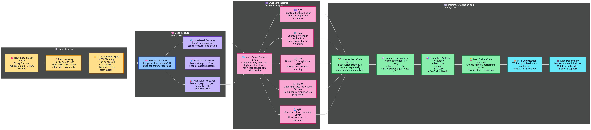

# BloodScan AI



## Project Summary

BloodScan AI is a full-stack leukemia screening workspace built to classify microscopic blood cell images into Acute Lymphoblastic Leukemia (ALL) blast cells and normal hematology cells. The project combines a custom quantum-inspired deep learning model, a FastAPI backend, a React/Vite frontend, local history storage, and Grad-CAM explainability so the workflow behaves like a practical diagnostic review tool rather than a plain image classifier demo.

The trained backend model is loaded from a TensorFlow/Keras `.keras` file, images are preprocessed and analyzed, predictions are generated for single images or batches, risk levels are derived, history is stored locally in SQLite, and the first uploaded image can be visualized with a heatmap explanation. The frontend wraps that pipeline in a structured patient intake and reporting experience.

## Objective

The objective of this repository is to support research-grade ALL screening from blood smear images by:

1. Detecting whether a cell belongs to the ALL blast class or the normal hematology class.
2. Showing predictions in a clinician-friendly interface with confidence, summaries, charts, and heatmaps.
3. Preserving analysis history so prior cases can be reviewed later.
4. Comparing multiple quantum-inspired fusion strategies during model training.
5. Demonstrating how a deep learning pipeline can be turned into an end-to-end application.

## Dataset

This project is built around the [C-NMC Leukemia](C-NMC_Leukemia/) dataset.

### Dataset Layout

- Training data: [C-NMC_Leukemia/training_data/](C-NMC_Leukemia/training_data/)
- Validation data: [C-NMC_Leukemia/validation_data/](C-NMC_Leukemia/validation_data/)
- Testing data: [C-NMC_Leukemia/testing_data/](C-NMC_Leukemia/testing_data/)

### Classes

- `all` - ALL blast cells
- `hem` - normal hematology cells

### Why this dataset was used

The dataset is appropriate for this project because it provides microscopic blood cell imagery needed for binary leukemia screening. That lets the model learn subtle morphology cues such as cell shape, staining patterns, nuclear appearance, and texture differences between malignant and healthy cells.

## Methodology

The implementation follows a staged deep learning workflow:

1. Load microscopy images from the C-NMC Leukemia folders.
2. Split the images into training, validation, and testing partitions.
3. Resize and normalize each image to the model input size.
4. Apply augmentation during training to improve robustness.
5. Extract multi-scale visual features using an ImageNet-pretrained Xception backbone.
6. Pass the extracted features through one of the quantum-inspired fusion layers.
7. Train the model in two phases: first with a frozen backbone, then with fine-tuning enabled.
8. Evaluate the best fusion variant using accuracy, precision, recall, F1-score, and AUC.
9. Save the best performing model and export the results for deployment.
10. Expose the model through the backend and render outputs in the frontend with Grad-CAM and history tracking.

### Training Strategy

The training script in [BloodScanAI_Training.py](BloodScanAI_Training.py) uses:

- an ImageNet-pretrained Xception backbone,
- three intermediate feature taps from different depths of the network,
- dense projection layers to align feature dimensions,
- class balancing to reduce bias,
- two-phase training for stability and fine-tuning,
- checkpointing, early stopping, and learning-rate reduction,
- and a final comparison across multiple fusion variants.

This design is meant to capture both low-level texture details and higher-level morphological patterns while keeping the model practical for deployment.

## Quantum Features Used

The project uses five custom quantum-inspired layers, defined in [BloodScanAI_Training.py](BloodScanAI_Training.py) and re-declared for model loading in [predict.py](predict.py).

### 1. QuantumFeatureFusion

**What it does:**
It blends projected features using learned phase-like and amplitude-like transformations, then adds the result back into the original feature vector.

**Why it was used:**
It is designed to merge feature information in a richer way than a plain concatenation or add operation, so the model can emphasize useful morphology patterns while still retaining the original signal.

**Effect on the model:**
It gives the network a more expressive fusion step when combining multi-scale Xception features.

### 2. QuantumAttention

**What it does:**
It computes a learned attention-style modulation using phase and amplitude projections, then rescales the input features.

**Why it was used:**
It helps the model focus on the most informative feature channels instead of treating every channel equally.

**Effect on the model:**
It acts like an adaptive importance filter for the projected cell features.

### 3. QuantumEntanglement

**What it does:**
It takes three projected feature streams, mixes pairwise interactions between them, concatenates the interaction terms, and projects them into a fused representation.

**Why it was used:**
The idea is to model dependency between different feature scales, which is useful when one layer may capture fine texture while another captures broader cellular structure.

**Effect on the model:**
It creates a stronger cross-feature interaction block than a simple stack of dense layers.

### 4. QuantumStateProjection

**What it does:**
It projects the feature vector through an orthogonal transformation, normalizes it, and adds a learned residual correction.

**Why it was used:**
It stabilizes the feature space and gives the model a controlled way to map visual information into a new representation.

**Effect on the model:**
It encourages structured, compact feature geometry before classification.

### 5. QuantumPhaseEncoding

**What it does:**
It generates phase-like transformations using learned dense projections and combines sine/cosine style encoding with the original feature vector.

**Why it was used:**
It provides another nonlinear transformation path that can expose hidden relationships in the image descriptors.

**Effect on the model:**
It enriches the feature space and helps the classifier separate ALL from HEM more effectively.

### Why these quantum-inspired features were used together

The training pipeline evaluates several fusion variants because no single fusion style is guaranteed to work best for every feature representation. The custom layers are used to simulate quantum-inspired behaviors such as interference, entanglement, phase rotation, and structured projection. In practice, that means the model is not just stacking visual features; it is transforming and combining them in ways that can reveal stronger class-discriminative patterns in blood smear imagery.

## Project Architecture

### Backend

The backend lives in [backend/app.py](backend/app.py) and exposes the inference and history workflow. It handles:

- service health checks,
- model metadata responses,
- single-image inference,
- batch inference,
- Grad-CAM heatmap generation,
- and local persistence of analysis history.

On startup, the service initializes the SQLite database, checks for GPU availability, loads the model, and runs a warm-up inference so the API is ready for requests.

### Frontend

The frontend lives in [frontend/src/App.jsx](frontend/src/App.jsx) and guides the user through:

1. Patient metadata entry.
2. Image upload.
3. Model processing.
4. Prediction review.
5. Heatmap and chart inspection.
6. History lookup for previous cases.

The service layer in [frontend/src/services/api.js](frontend/src/services/api.js) checks backend availability first and falls back to demo behavior when the API is offline.

## Tech Stack

### Frontend

- React 18
- Vite
- Tailwind CSS
- Framer Motion
- Recharts
- react-dropzone

### Backend

- FastAPI
- Uvicorn
- TensorFlow / Keras
- NumPy
- Pillow
- Matplotlib
- SQLite3

## Repository Structure

- [backend/](backend/) - FastAPI service, model loading, prediction logic, history storage, and Dockerfile.
- [frontend/](frontend/) - React application and UI components.
- [BloodScanAI_Training.py](BloodScanAI_Training.py) - training script for the quantum-inspired fusion models.
- [predict.py](predict.py) - custom layers required to load the trained model.
- [C-NMC_Leukemia/](C-NMC_Leukemia/) - dataset assets used for training, validation, and testing.
- [fusion_results.csv](backend/fusion_results.csv) - training metrics used by the API.
- [run_bloodscan.bat](run_bloodscan.bat) - Windows helper script to start the stack.

## Setup

### Prerequisites

- Node.js 18 or newer
- Python 3.9 or newer
- A virtual environment is recommended for the backend

### 1. Clone the repository

```powershell
git clone https://github.com/Krishaaashah/BloodSCAN.git
cd BloodSCAN
```

### 2. Set up the backend

```powershell
cd backend
pip install -r requirements.txt
```

If the trained model file is not already present, make sure the `.keras` model expected by the backend exists in the backend folder or update the model path through the environment variables described below.

### 3. Set up the frontend

```powershell
cd ..\frontend
npm install
```

## Running the App

### Option 1: Use the Windows launcher

```powershell
.\run_bloodscan.bat
```

### Option 2: Run services manually

Backend:

```powershell
cd backend
python -m uvicorn app:app --host 0.0.0.0 --port 8000 --reload
```

Frontend:

```powershell
cd frontend
npm run dev
```

By default the frontend runs on Vite’s local development server and connects to the backend through `VITE_API_URL` or the `/api` proxy path.

## Environment Variables

The backend supports these overrides:

- `MODEL_PATH` - path to the `.keras` model file.
- `FUSION_RESULTS_PATH` - path to the CSV containing training metrics.
- `DB_PATH` - path to the SQLite database used for history.

The frontend can use:

- `VITE_API_URL` - backend base URL if you are not using the default `/api` route.

## Notes on Output

- The model comparison metrics are stored in `fusion_results.csv`.
- Analysis history is saved locally in SQLite so the UI can reload previous reports.
- Grad-CAM is used to show which image regions most influenced the prediction.
- The repository also includes plots, summaries, and supporting artifacts from the training process.

## Important Disclaimer

BloodScan AI is intended for portfolio, research, and demonstration purposes only. It is not a medical device and must not be used as a substitute for professional diagnosis, treatment, or clinical decision-making.

## PS

PS: This README now follows the project flow more closely, starting from the summary and objective, then covering the dataset, methodology, quantum-inspired layers, and setup instructions in one place. If you want, I can also add an API reference table or a simple architecture diagram next.
